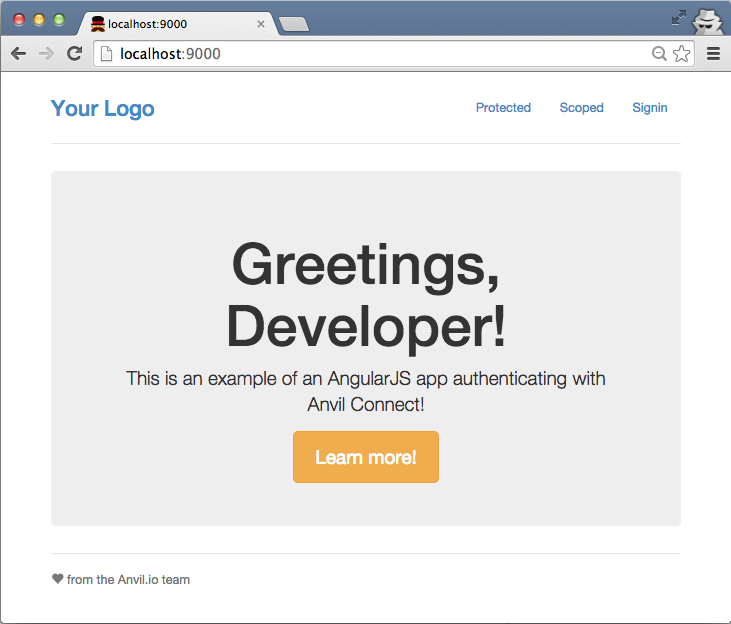
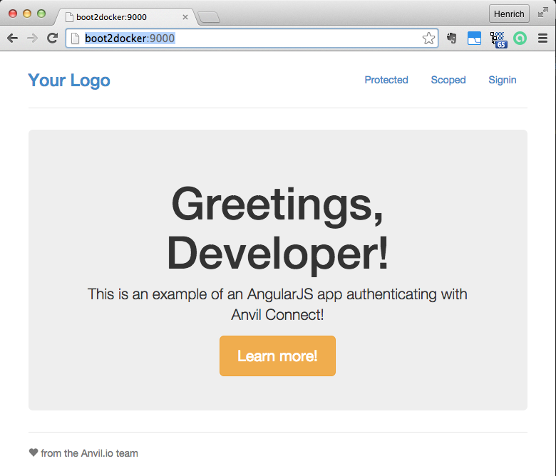
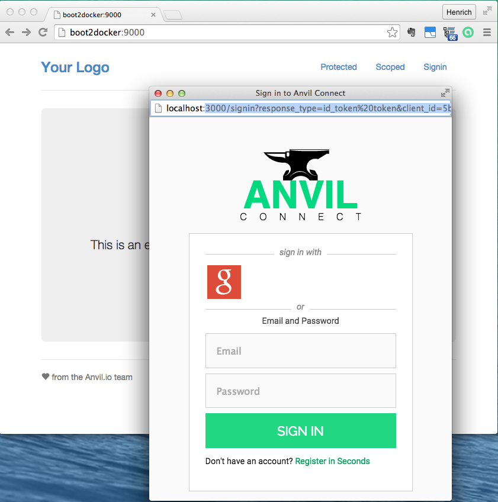
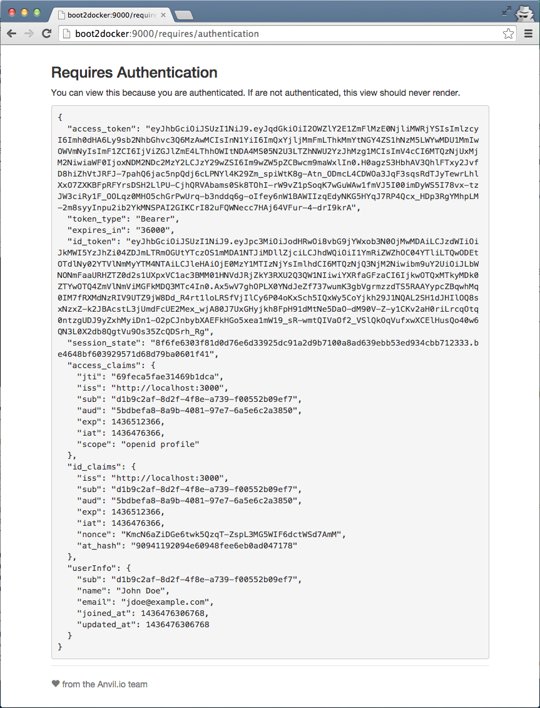
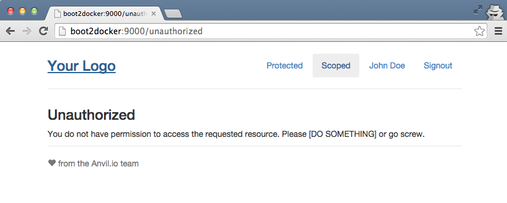
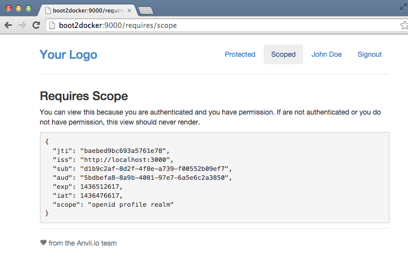

# Anvil Connect AngularJS Example

**Anvil Connect** aims to be a scalable, full-featured, ready-to-run
[**OpenID Connect**](http://openid.net/connect/) + [**OAuth 2.0**](http://tools.ietf.org/html/rfc6749) **Provider**.

This repository demonstrates authenticating users of an AngularJS app using Anvil Connect.

## Prerequisites

### Setup server:
Setup [Anvil Connect authorization server](https://github.com/anvilresearch/connect/blob/master/README.md)

These instructions assume that the Anvil Authorization server (issuer) runs on localhost:3000 in development mode (not using docker). However it should also be adaptable to using docker.

One must register the application with the issuer. For this the cli is used. The [cli must be setup](https://github.com/anvilresearch/connect-docs/blob/master/cli.md) first so that you can login to the server.

### Get connect-js client libraries

There is currently work in progress to update the client libraries to use
webcrypto APIs instead of encryption libraries. See
[Webcrypto API · Issue #7 · anvilresearch/connect-js](https://github.com/anvilresearch/connect-js/issues/7) for more details.

To get the webcrypto code for testing the fork is used:

```console
$ # create or got to some suited directory then
$ git clone https://github.com/henrjk/connect-js.git
$ cd connect-js
$ git checkout webcrypto

## These steps are described here: https://github.com/henrjk/connect-js/tree/webcrypto
$ npm install
$ jspm install
$ npm run test
```

Next get this project and npm link it with the connect-js library installed
in the previous step

```console
$ # create or got to some suited directory. This could be the same as above.
$ git clone https://github.com/henrjk/connect-example-angularjs.git
$ cd connect-example-angularjs
$ git checkout use-npm
```

No go to the directory where connect-js was cloned to and issue these commands:
```console
connect-js dev (webcrypto)$ npm link

> anvil-connect-js@0.2.0 prepublish /Users/dev/code/work/connect-js-fork/connect-js
> npm run build


> anvil-connect-js@0.2.0 build /Users/dev/code/work/connect-js-fork/connect-js
> grunt

Running "clean:dist" (clean) task
>> 24 paths cleaned.

Running "babel:compile" (babel) task

Done, without errors.
/Users/dev/.nvm/versions/node/v0.12.6/lib/node_modules/anvil-connect-js -> /Users/dev/code/work/connect-js-fork/connect-js
connect-js dev (webcrypto)$
```

Then go back to the `connect-example-angularjs` directory and do the following:

```console
connect-js dev (webcrypto)$ cd ../connect-example-angularjs/
connect-example-angularjs dev (use-npm)$ npm link anvil-connect-js
/Users/dev/code/work/connect-js-fork/connect-example-angularjs/node_modules/anvil-connect-js -> /Users/dev/.nvm/versions/node/v0.12.6/lib/node_modules/anvil-connect-js -> /Users/dev/code/work/connect-js-fork/connect-js

connect-example-angularjs dev (use-npm)$ npm install
# this takes a few minutes...


connect-example-angularjs dev (use-npm)$ bower install
# this goes much quicker...
```

Now you will have to come up with a authconf.json file in the projects
root folder which matches your server. This is described below although I have
not recently verified these steps. Here is an outline of the steps:

* Determine correct `authconf.json` file and place it in connect-example-angularjs root folder.
* grunt build
* login to the server (nvl login)
* execute script generated by grunt build: `./dist/register_with_anvil_connect.sh`
* Observe the assigned client ID and update `authconf.json` accordingly.
* grunt serve

This should build the browser app configured correctly for the client registration
in folder app.browser, browserify the dependencies and the open a browser
showing the 


## Register the client and generate matching angular sources.
To allow the app to connect to the authorization server a client (representing)
the app must be configured in the authorization server.

In addition the angular app must make requests matching with the client
registration.

To achieve this the configuration information for the client is stored in file
`authconf.json`.

You will find that this file is **not** checked in. Instead there are files with
similar names which are checked in. These are good starting points for your
client registration. They differ
depending on whether there is a distinct docker host which is *not* localhost or
not. Also there are
differences on how the authentication is displayed, for example using a popup or
a new page.

Use one of these as a starting point and copy them to `authconf.json`. For
example when running using docker via boot2docker the following is a good starting
point:

```console
cp authconf.dev.b2d.json authconf.json
```
If you do not use boot2docker, for example if you want to serve directly
via `grunt serve` then use:

```console
cp authconf.dev.localhost.json authconf.json
```

The Anvil Authentication server recognizes clients by an id which is generated
when they are registered. Therefore the starting point is not yet final as the
id in there must be changed. To help with ensure that the client registration
matches what the generated angular app uses, a registration script is generated
in `dist/register_with_anvil_connect.sh`.

First generate the script by:

```console
grunt build
```

Next login to the cli.

```console
dev$ nvl login
? Select an Anvil Connect instance localhost:3000 (localhost-3000)
Selected issuer localhost:3000 (http://localhost:3000)
Warning: you are communicating over plain text.
? Enter your email example@gmail.com
? Enter your password ************
You have been successfully logged in to localhost:3000
```

Use the generated `dist/register_with_anvil_connect.sh` as follows in the root directory of your Anvil Connect Authentication
server:

```console
dev$ ./dist/register_with_anvil_connect.sh
Registering this client with localhost-3000
Succeeded.
Define CLIENT_ID as follows in authconf.json:
{
...
  "CLIENT_ID" : "29dcbf2a-88d6-4038-b9f9-6bf425104b59",
...
}
```

The id shown will be unique to your authentication server. Replace the existing
`CLIENT_ID` in `authconf.json` with the one you see in your output.

## Run with angular app served by grunt serve

In this scenario we are using a simple build server via grunt.

TODO:

```console
dev$ grunt serve
Using authconf.json

Running "serve" task

Running "clean:server" (clean) task
Cleaning .tmp...OK
Cleaning dist...OK

Running "concurrent:server" (concurrent) task

    Using authconf.json

    Running "copy:styles" (copy) task
    Copied 1 files

    Done, without errors.


    Execution Time (2015-07-10 19:49:12 UTC)
    loading tasks  20ms  ▇▇▇▇▇▇▇▇▇▇▇▇▇▇▇ 31%
    copy:styles    41ms  ▇▇▇▇▇▇▇▇▇▇▇▇▇▇▇▇▇▇▇▇▇▇▇▇▇▇▇▇▇▇ 63%
    Total 65ms

    Using authconf.json

    Running "copy:dist" (copy) task
    Created 5 directories, copied 10 files

    Done, without errors.


    Execution Time (2015-07-10 19:49:12 UTC)
    loading tasks   18ms  ▇▇▇▇▇ 9%
    copy:dist      183ms  ▇▇▇▇▇▇▇▇▇▇▇▇▇▇▇▇▇▇▇▇▇▇▇▇▇▇▇▇▇▇▇▇▇▇▇▇▇▇▇▇▇▇▇ 91%
    Total 202ms

Running "connect:livereload" (connect) task
Started connect web server on http://localhost:9000

Running "watch" task
Waiting...
```

As a result the browser should open the home page like this:


When changes are made to the app this should readily refresh the browser.

These pages should look the same as in the docker use case which shows some more pages except that these are running under `http://localhost:9000` instead of `http://boot2docker:9000`.

## Run with angular app served by docker

In this scenario nginx serves the angular app running inside a docker container.

If you have not followed the steps in section **Prerequisites** do this first.
Otherwise regenerate the app with the latest sources and the registered
client-id.

    grunt build

Next build the docker image
    docker-compose build

Server the angular app via nginx running in a docker container:
    docker-compose up -d

To debug:
    docker-compose run --service-ports angular sh

If you are using boot2docker (typically used on OS X and Windows) nginx will
not be available from OS X (Windows) under localhost:9000 but rather at where
`boot2docker ip` reports it. In most cases this is at `192.168.59.103`.

To simplify referring to this we will assume that you will have a corresponding
entry in your `/etc/hosts` file:
```console
192.168.59.103	boot2docker
```

With that you can open your browser on either `http://localhost:9000` or `http://boot2docker:9000`. You should see something like this:



After selecting SignIn with the configured popup display the following is shown:



When selecting *Protected* the session information is shown:



When selecting *Scoped* logged in but not having the proper authorized level:



After having the user in Anvil Connect assigned authority:

```console
mac:anvil-connect dev$ nv assign jdoe@example.com authority
d1b9c2af-8d2f-4f8e-a739-f00552b09ef7 now has the role "authority."
```console

The scope page remained unauthorized until Signout followed by a new SignIn.
After this the page showed the following:


